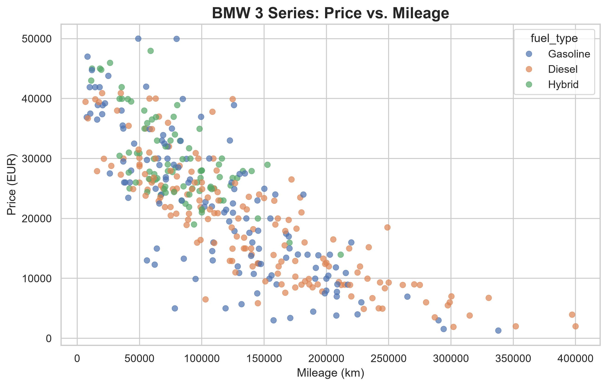
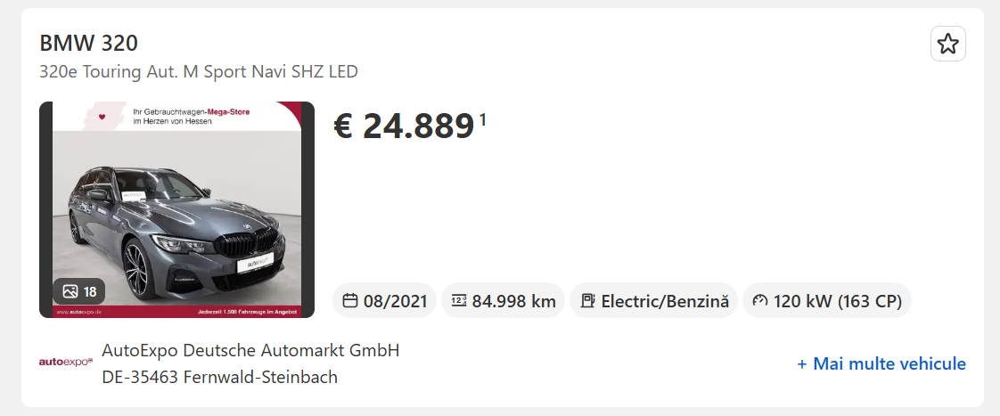
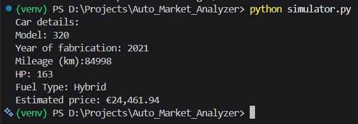

# Auto Market Price Predictor & ETL Pipeline

An end-to-end Data Engineering and Machine Learning project designed to extract live vehicle market data, process it in the cloud, and predict accurate market values using artificial intelligence. 

## 🏗️ Architecture & Features

* **Automated ETL Pipeline:** Built with Python and BeautifulSoup to extract live vehicle listings from AutoScout24. Implements user-agent rotation and dynamic delay to bypass bot-detection mechanisms.
* **Cloud Database & Idempotency:** Integrates with Supabase (PostgreSQL). Uses memory-efficient batch querying (`.in_()`) to validate existing records, ensuring data idempotency and enabling historical price tracking without duplicating entries.
* **Machine Learning Model:** Utilizes a Random Forest Regressor (`scikit-learn`) trained on dynamic features (mileage, fuel type, model year, horsepower). Text categories are processed using One-Hot Encoding.
* **Interactive CLI Simulator:** A functional command-line interface that loads the exported `.pkl` AI model to generate instant, data-driven price predictions based on user input.

## 🚀 Tech Stack

* **Language:** Python
* **Data Extraction:** BeautifulSoup4, Requests, Regex
* **Data Science & ML:** Pandas, Scikit-Learn, Matplotlib, Seaborn, Joblib
* **Database & Cloud:** Supabase (PostgreSQL), python-dotenv

## 📊 Model Performance
* **Algorithm:** Random Forest Regressor
* **Accuracy (R-Squared):** 82.51%
* **Feature Engineering:** One-Hot Encoding (drop_first=True) to prevent perfect multicollinearity.

## 💻 How to Run the Simulator

1. Clone the repository:
   `git clone https://github.com/yourusername/auto-market-analyzer.git`
2. Install the required dependencies:
   `pip install -r requirements.txt`
3. Run the interactive AI simulator:
   `python simulator.py`

## 📊 Data Visualization

The initial Exploratory Data Analysis (EDA) confirms the real-world depreciation curve of the BMW 3 Series across different fuel types:

## 🎯 Real-World Accuracy Test

To validate the model, we compared a live, unseen AutoScout24 listing against the CLI Simulator's prediction:

| Real Market Listing | AI Simulator Prediction |
| :---: | :---: |
|  |  |

**Result:** The actual price of the BMW 320e Hybrid is **€24,889**. The AI predicted **€24,461.94**. 
With an error margin of just **~€427** (under 2%), the model demonstrates a highly accurate understanding of vehicle depreciation, feature weighting, and current market trends.